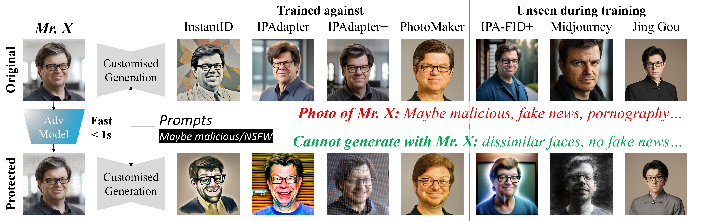

<div align="center">
<h1>IDProtector：一种用于防御身份保持图像生成的对抗噪声编码器</h1>
</div>

<div align="center">
    <a href="https://scholar.google.com/citations?user=L2YS0jgAAAAJ&hl=en">Yiren Song</a><sup>&#42;</sup>&nbsp;, <a href="https://scholar.google.com/citations?user=eBvav_0AAAAJ">Pei Yang</a><sup>&#42;</sup>&nbsp;, <a href="https://scholar.google.com/citations?user=GMrjppAAAAAJ&hl=en">Hai Ci</a><sup>&#x2709</sup>, and <a href="https://sites.google.com/view/showlab">Mike Zheng Shou</a><sup>&#x2709</sup>

</div>

<div align="center">
    <sup>&#42;</sup>共同一作 &nbsp; <sup>&#x2709</sup>通讯作者
</div>

<div align="center">
    <a href='https://sites.google.com/view/showlab/home?authuser=0' target='_blank'>Show Lab</a>，新加坡国立大学
    <p>
</div>

<div align="center">
    <a href="https://arxiv.org/abs/2412.11638">
        
    </a>
    <p>
</div>

<br>

## ⭐ 简介



IDProtector 是一个为图像添加保护噪声的模型。这样，当受保护图像被用于基于编码器的身份保持生成时，生成的人脸将不再与原始人脸相似，从而实现隐私保护。

## 🚀 快速开始

### 环境要求
 - Python 3.9.18：`conda create -n IDProtector python=3.9.18`
 - CUDA 11.6

### 安装依赖
```bash
conda install pytorch==2.4.1 torchvision==0.19.1 torchaudio==2.4.1 pytorch-cuda=11.8 -c pytorch -c nvidia

pip install transformers huggingface-hub spaces numpy accelerate safetensors omegaconf peft==0.12.0 gradio insightface==0.7.3 jupyter matplotlib wandb kornia diffusers["torch"]==0.29.2 transformers==4.37.2 tokenizers==0.15.2 onnxruntime onnx2torch einops timm tensorboard mxnet-cu116 scikit-image scikit-learn opencv-python brisque pyiqa torch-dct

conda install -c conda-forge nccl
```

### 克隆仓库
```bash
git clone https://github.com/yangpei-comp/IDProtector_Preview.git
git submodule init
git submodule update
```

### 下载模型
1. 在仓库根目录下运行 `python -m scripts.setup.model_setup`
2. 如果你的 Hugging Face 模型缓存路径不是默认路径，请前往 `modules/model_instances.py`，将以 `PATH` 开头的变量改成对应路径
3. 从[此链接](https://drive.google.com/file/d/18wEUfMNohBJ4K3Ly5wpTejPfDzp-8fI8/view)下载 antelopev2 模型，并放到 `generation_methods/InstantID/models/antelopev2/*.onnx`
4. 下载 InstantID 模型：
```bash
cp scripts/setup/model_setup_instantid.py generation_methods/InstantID/
cd generation_methods/InstantID
python model_setup_instantid.py
```
5. 下载 IPAdapter 模型：
```bash
cd generation_methods/IP_Adapter
git lfs install
git clone https://huggingface.co/h94/IP-Adapter
mv IP-Adapter/models models
mv IP-Adapter/sdxl_models sdxl_models
```
6. 从[此链接](https://drive.google.com/file/d/17fEWczMzTUDzRTv9qN3hFwVbkqRD7HE7/view?usp=sharing)下载 insightface 模型，并放到 `utils/FaceImageQuality/insightface/model`

## ⚡ 推理

### 运行完整实验

1. 将需要保护的图片（jpg 或 png）放到一个文件夹中，并记录该文件夹路径。
     - 每张图片都必须包含可被 ArcFace 检测到的人脸。若存在多张人脸，将对最大的人脸进行保护。
     - 每张图片必须是 512×512 像素。若你希望保护任意尺寸图片，请参考[仅运行保护](#run-protection-only)。
2. 运行保护与生成实验：
```bash
bash scripts/evaluation/run_eval.sh \
$cuda_index \
/path/to/ref_imgs \
/path/to/data_dir \
/path/to/gen_dir
```
3. 你可以在 `data_dir/IDProtector/clean` 中找到受保护图片。实验结果和各种指标会以多个 CSV 文件形式保存在 `gen_dir` 对应目录下。请参考 [文件组织](docs/file_organisation.md)。

### <a id="run-protection-only"></a>仅运行保护（Run Protection Only）

如果你只需要使用 IDProtector 来保护图片，请将任意尺寸且包含人脸的 jpg/png 图片放到 `/path/to/input_dir`，然后运行：

```bash
CUDA_VISIBLE_DEVICES=$cuda_index python -m scripts.evaluation.perturb_get_metric \
--in_channels 5 \
--epsilon ${epsilon} \
--clip_epsilon ${clip_epsilon} \
--clean_data_dir /path/to/input_dir \
--save_dir /path/to/output_dir \
--path_to_state_dict ${path_to_state_dict} \
--metrics_save_path /path/to/output_dir/metrics.csv \
--batch_size 1 \
--cuda 0
```

## 📄 引用

```
@inproceedings{song2025idprotector,
    title={IDProtector: An Adversarial Noise Encoder to Protect Against ID-Preserving Image Generation},
    author={Song, Yiren and Yang, Pei and Ci, Hai and Shou, Mike Zheng},
    booktitle={Proceedings of the Computer Vision and Pattern Recognition Conference},
    pages={3019--3028},
    year={2025}
}
```
